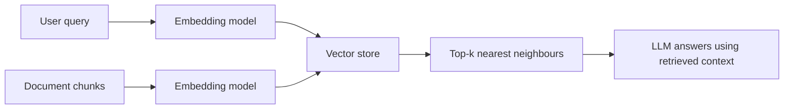

## test change
Embeddings map text (or images, or audio) into a vector space where semantic
similarity becomes geometric closeness. Two pieces of text that mean similar
things end up as vectors that point in similar directions.

## The similarity math

For two embedding vectors \(\vec{a}\) and \(\vec{b}\), cosine similarity is:

\[
\text{sim}(\vec{a}, \vec{b}) = \frac{\vec{a} \cdot \vec{b}}{\lVert \vec{a} \rVert \, \lVert \vec{b} \rVert}
\]

A value close to \(1\) means the two pieces of text are semantically close.

## A minimal example

```python
import numpy as np

def cosine_similarity(a: np.ndarray, b: np.ndarray) -> float:
    return float(np.dot(a, b) / (np.linalg.norm(a) * np.linalg.norm(b)))

query = embed("What is a vector database?")
doc = embed("Vector databases index embeddings for fast similarity search.")
print(cosine_similarity(query, doc))
```

## How a typical retrieval pipeline fits together



If you're building your first retrieval-augmented app, start here before
reaching for a framework — understanding the vectors makes debugging the
framework much easier later.
